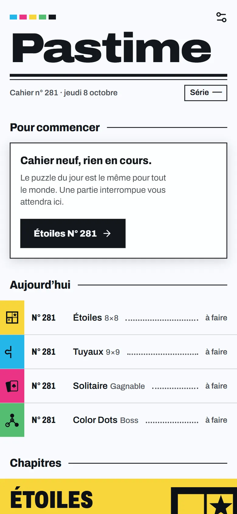
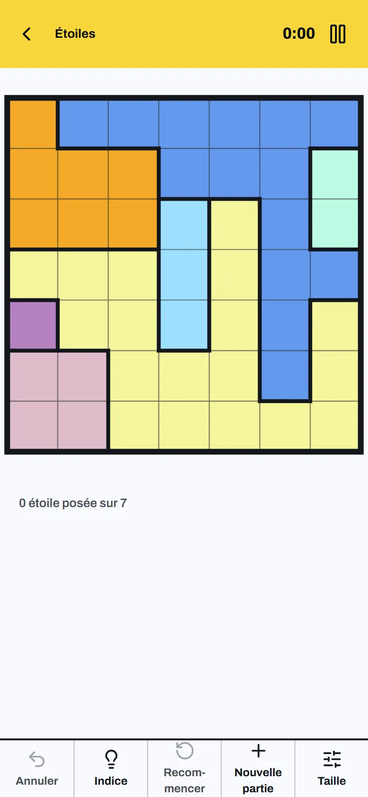
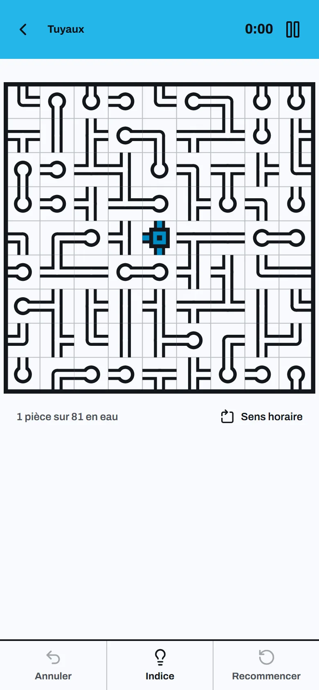
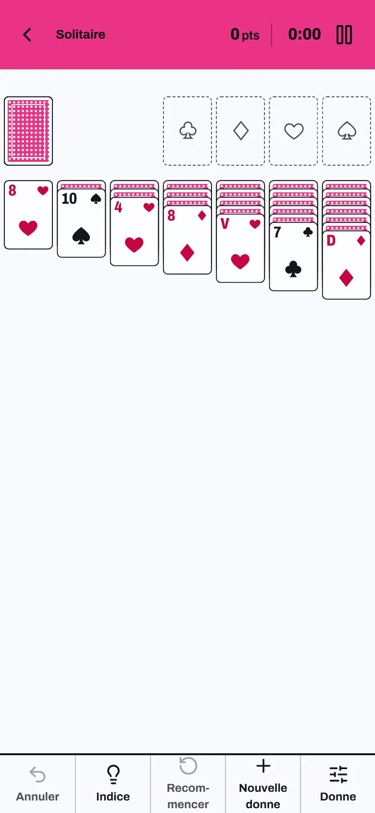
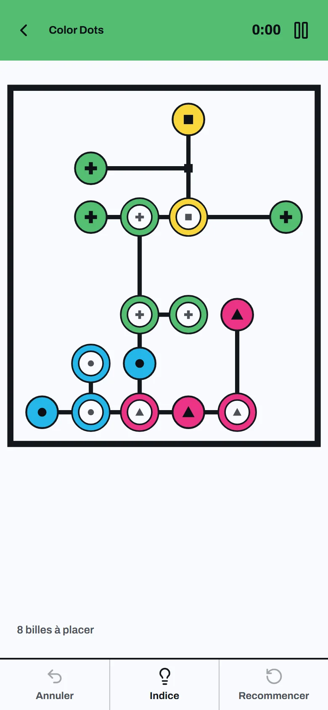

# Pastime

Small solo games in one app: Stars, Pipes, Solitaire and Color Dots, as many
levels as wanted. It works offline and installs on a phone's home screen;
there is no server. Every level is generated on the device and checked before
it is shown, and the next one is printed ahead, so a new game never waits.

**Play:** [pastime.adrienlcp.com](https://pastime.adrienlcp.com)

<p>
  
  
  
  
  
</p>

## How levels are generated and checked

A new level starts from 32 random bits, fed to one seeded PRNG: the seed is
kept with the game in progress, so a resumed or replayed game prints the same
board. Generators run in a Web Worker; one that times out or gives up is
retried with a seed derived from the first. Once a level is on screen, the
next one of the same size, deal or difficulty is printed in the worker while
the page is idle and kept on the device, so a new game opens at once.

- **Stars.** A random star solution is placed first, then regions are grown
  around it and reshaped cell by cell until the logical solver fills the whole
  grid without a guess, which proves the solution unique. The hardest
  technique the solver needed is the level's difficulty; each size sets a
  floor.
- **Pipes.** A random spanning tree is grown from the centre and every tile is
  turned away from its solved position. Where the logical solver stalls, the
  tree is reshaped around the stuck tiles, as in Simon Tatham's Net, until
  logic alone solves it: one solution, no guess.
- **Solitaire.** Klondike, draw one. A seeded shuffle is kept only if a
  depth-first solver wins it within its search budget; otherwise the next
  shuffle is tried. Every winnable deal is proven so; the random deal takes
  any shuffle, for the purists.
- **Color Dots.** Levels are built backwards from the solved board: balls are
  taken out of their rings one by one, each placement kept only if the game's
  own move rides the ball straight back. Played forwards, that order is a
  guaranteed win, replayed once more before the level ships. Difficulty counts
  traps, moves that are legal yet leave the board unwinnable: Easy, Hard and
  Expert each ask for more balls and more traps.

Saves and best times live in `localStorage`, behind versioned keys read
through schemas: a value the app does not recognise reads as absent.

## Develop

Node 26 and pnpm 12 (`corepack enable`).

```sh
pnpm install
pnpm dev        # http://localhost:5530
pnpm validate   # lint, spell, build, test: what CI runs
```

`pnpm preview` serves the production build, service worker included, on port
5531. How the code is laid out, and why there is no server:
[`docs/architecture.md`](docs/architecture.md); each game's rules and
generator: [`docs/games/`](docs/games).

## Deploy

Every push to `main` that passes CI deploys `dist/` to Cloudflare Pages. There
is nothing else to run: no server, no database, no running cost.

## License

AGPL-3.0. The Archivo and Gochi Hand fonts are under the SIL Open Font
License 1.1 (`public/fonts/archivo-OFL.txt`, `public/fonts/gochi-hand-OFL.txt`).
`public/fonts/gochi-hand-latin.woff2` is a modified Gochi Hand: tabular
figures added and, as its license reserves the names "Gochi" and "Gochi
Hand", served as Pastime Hand. `scripts/add-tabular-figures.py` regenerates
it from the original subset; its docstring gives the commands.
